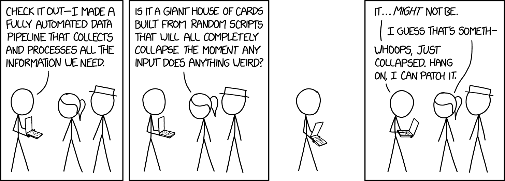
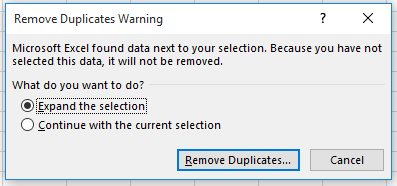
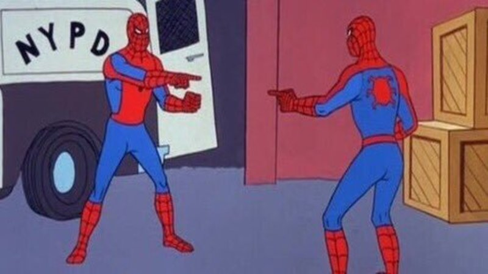
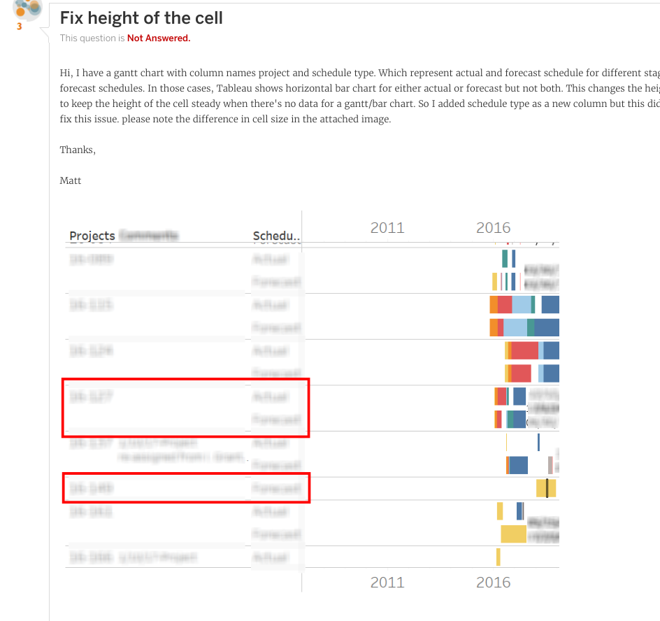
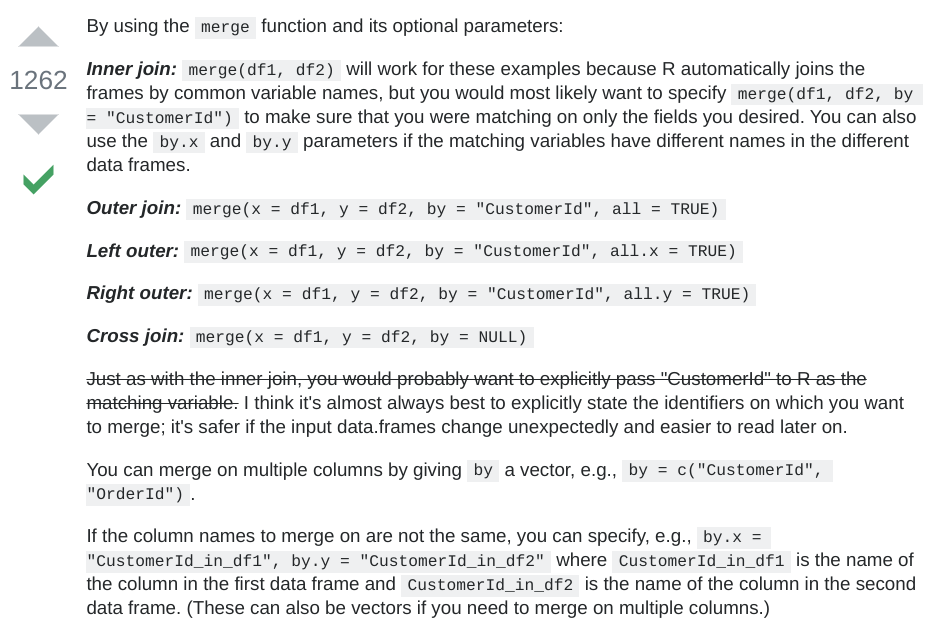
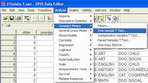

```{r setup, include=FALSE}
knitr::opts_chunk$set(echo = FALSE)
```

## Grounding

1. Data analysis offers the power to critically examine and improve our organizations and advance their missions

2. The way we do data analysis isn't (always) conducive to this

3. Using code can help

## A story

<div class="centered">

</div>

## Four tables

Ran 30+ reports and organized into four tables

1. Characteristics
2. Activity
3. Test scores
4. Outcomes

Allows me to do any analysis I need and not rely on specific reports

## Characteristics

> - ID
> - name
> - race
> - gender
> - program
> - program start date

## Activity

```{r}
N <- 100

act <- tibble::tibble(

    id = sample(1L:100L, N * 15, replace = TRUE),
    activity = sample(c("case management", "education", 
                        "employment"), N * 15, replace = TRUE),
    date = sample(seq(as.Date('2015-01-01'), 
                            as.Date('2019-12-01'), by="day"), N * 15)

)

act

```

## Test scores

```{r}

test <- tibble::tibble(
    id = sample(1L:100L, N * 2, replace = TRUE),
    test = sample(c("TABE", "GED"), N * 2, replace = TRUE),
    test_date = sample(seq(as.Date('2015-01-01'), 
                            as.Date('2019-12-01'), by="day"), N * 2),
    score = runif(N * 2, 1, 100)
)

test

```

## Outcomes

```{r}

outcomes <- tibble::tibble(
    id = sample(1L:100L, N / 2, replace = TRUE),
    outcome_date = sample(seq(as.Date('2015-01-01'), 
                            as.Date('2019-12-01'), by="day"), N / 2),
    outcome = sample(c("education", "employment"), N / 2, replace = TRUE)
)

outcomes 

```
## Tidy data

https://vita.had.co.nz/papers/tidy-data.pdf

<div class="centered">

</div>

- Recreated relational databases that worked for me
- If you can't use code, can still get data in this format
    - load into Tableau, Power BI, etc. for reproducible analysis

# Why is code helpful? 

## Provenance

<div class="centered">

</div>

https://www.youtube.com/watch?v=cpbtcsGE0OA

## Reproducible

<div class="centered">

</div>

- Shareable
- Modifiable 
- Updatable

## Plain Text

### Copy and paste

non-pasteable | pasteable
:--------------:|:-------------------------:
 |  | 

### Google / www.stackoverflow.com

## Open Source

<div class="centered">

</div>

## Powerful

<div class="centered">

</div>

# So what?

## Go beyond counting

Ask different kinds of questions

1. What did ... ? 

2. Why did ... ?

3. What will ... ? 

## Look at relationships

```{r, echo=TRUE, message=FALSE, warning=FALSE}

library(tidyverse)

test_cm <- act %>%
    filter(activity == "case management") %>%
    count(id) %>%
    inner_join(test, by = "id") %>%
    filter(test == "GED")

test_cm
```
## Look at relationships

```{r, echo=TRUE, message=FALSE, fig.height=3.5, fig.asp=0.618, fig.align="center"}

test_cm %>%
    ggplot(aes(n, score)) +
        geom_point() +
        geom_smooth()

```

## Regression

```{r, echo=TRUE}

cm_model <- lm(score ~ n, data = test_cm)

summary(cm_model)

```

## Prediction

```{r, eval=FALSE, echo=TRUE}

library(randomForest)

randomForest(outcome ~ ., data = outcomes)

```

## Where to start with coding?

### Languages 

- SQL and (R or Python)

### Resources

- [R for Data Science](https://r4ds.had.co.nz/) and [learning community](https://www.rfordatasci.com/)

- Google

- Twitter

- SQL is easiest to learn at work


## Focus on questions that matter

- Incentives are not designed to critically examine our work

- Using code and good data organization principles allows us to focus energy on asking deeper questions and investigating relationships

## Contact Info

Joe Ciesielski

jtcies@gmail.com
